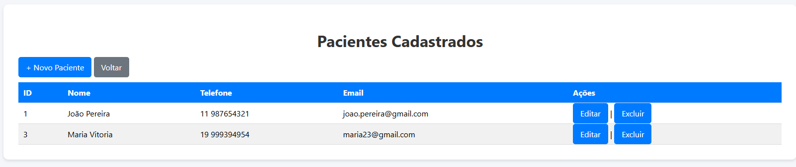
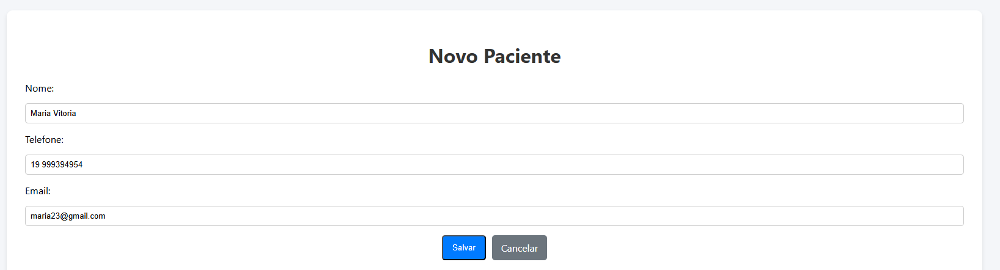

# Agenda de Contatos

Sistema web desenvolvido em **Spring Boot + Thymeleaf + MySQL** para gerenciar pacientes.

---

## 🚀 Tecnologias

| Categoria | Tecnologias |
|------------|--------------|
| Backend | Java 17 · Spring Boot · Spring Data JPA |
| Frontend | Thymeleaf · HTML5 · CSS3 |
| Banco de Dados | MySQL |

---

## ⚙️ Funcionalidades

- 📋 Listar pacientes  
- ➕ Cadastrar novo paciente  
- ✏️ Editar paciente existente  
- ❌ Excluir paciente  

---

## 🖥️ Telas do Sistema

### ✏️ Página Inicial
Direciona para a dashboard do projeto.

<p align="center">

</p>
---

### 📋 Lista de Pacientes  
Exibe todos os pacientes cadastrados com opções para editar ou excluir.

<p align="center">

</p>

---

### ➕ Novo Paciente  
Formulário para adicionar novos pacientes ao sistema.

<p align="center">

</p>

---

## 🧩 Como Executar

1. Configure o banco MySQL no arquivo `application.properties`:
   ```properties
   spring.datasource.url=jdbc:mysql://localhost:3306/agendamedica
   spring.datasource.username=root
   spring.datasource.password=senha
   spring.jpa.hibernate.ddl-auto=update

2. Rode o projeto:
   ```properties
   AgendaMedicaApplication.java
3. Acesse:
   ```properties
   http://localhost:8080/view/pacientes
